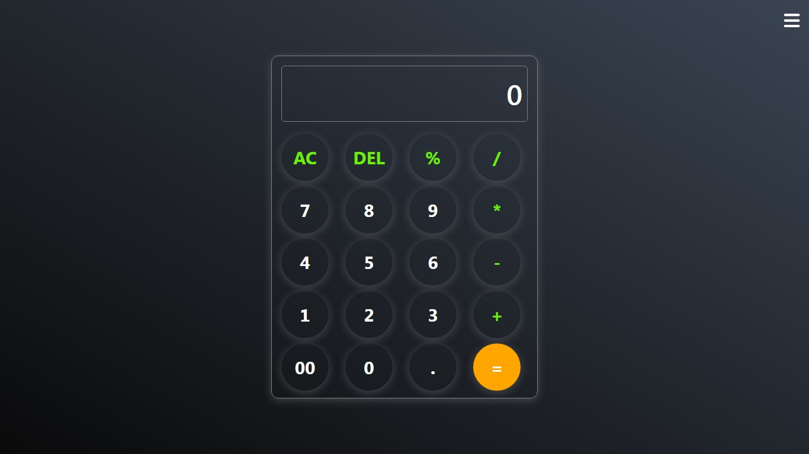
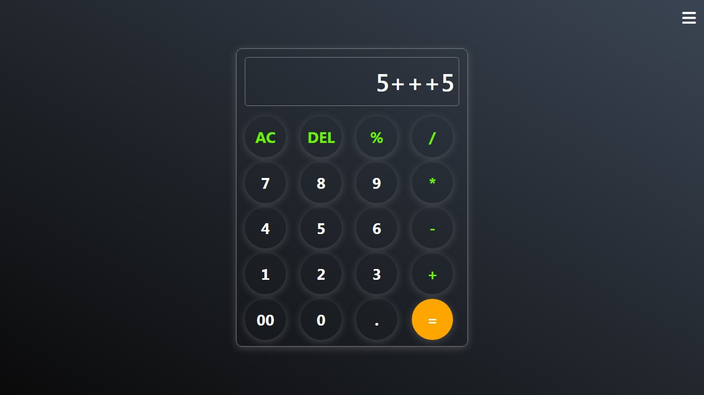
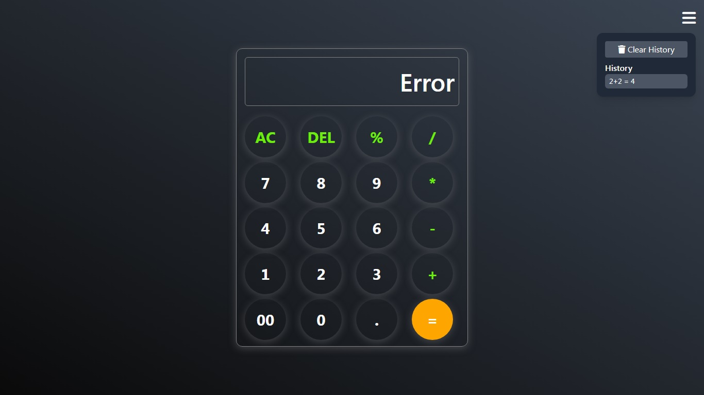

# 🧮 Calculator Web Application
### [Live Link](https://codingmation.github.io/SCT_WD_02/)

This is a responsive and interactive **calculator web app** built using **HTML**, **Tailwind CSS**, and **JavaScript**.  
It supports basic arithmetic operations and a history feature.  

---

## 🚀 Features

✅ Responsive modern design (works on desktop & mobile)  
✅ Basic operations: addition, subtraction, multiplication, division, percentage  
✅ "AC" (All Clear) and "DEL" (Delete last entry) buttons  
✅ Calculation history (with option to clear)  
✅ Hamburger menu to manage settings and history  
✅ Font Awesome icons for modern UI feel  
✅ Smooth button hover effects

---

## 💡 Technologies Used

- **HTML5** for structure
- **Tailwind CSS** for styling
- **Vanilla JavaScript** for logic and DOM manipulation
- **Font Awesome** for icons

---

## ⚙️ Setup

1️⃣ Clone or download this repository.  
2️⃣ Make sure you have an internet connection for Tailwind and Font Awesome CDN.  
3️⃣ Open `index.html` in your browser — that's it!  

---

## ✨ Usage

- Click number buttons or operators to build your expression.
- Press `=` to calculate.
- Use `AC` to reset all.
- Use `DEL` to delete the last character.
- View or clear history from the hamburger menu.
- Also have keyboard input support

---

## 📸 Screenshots

### main

### history

### Error

### showing Error

---

## 🙌 Contributing

Contributions are welcome!  
Feel free to open issues or create pull requests to improve the project.

---

## 📝 License

This project is open-source and free to use. You can customize it as per your needs.

---

## 💬 Contact

If you have questions or suggestions, feel free to reach out.  
Made with ❤️ by Sythe.

---
